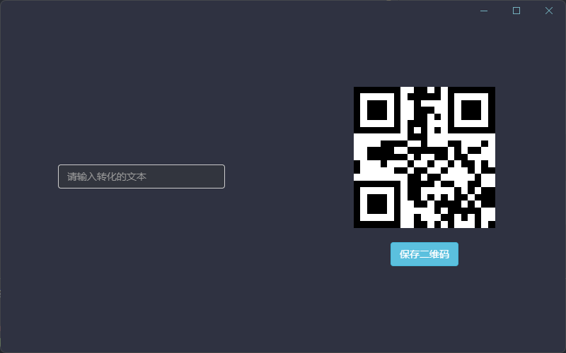

# QRcodeForWindows

一款windows上的二维码转换的软件

基于electron制作，使用webpack打包

## 食用方法

1. npm安装

    ```shell
    npm i
    ```

2. 运行

   ```shell
   npm start
   ```

   

3. 打包exe

   ```shell
   npm run package
   ```

   运行完成后打包到`./out`文件夹下
